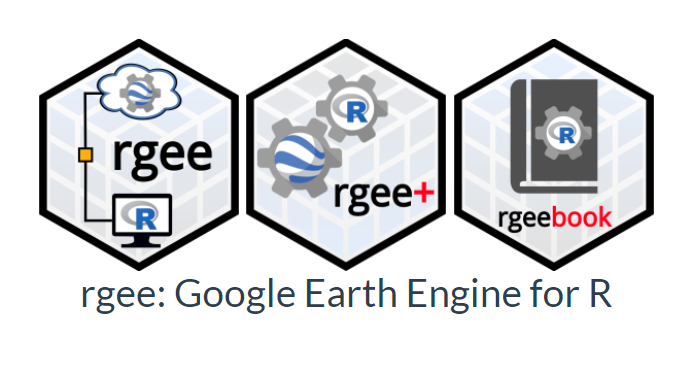

<!-- README.md is generated from README.Rmd. Please edit that file -->

```{r, include = FALSE}
knitr::opts_chunk$set(
  collapse = TRUE,
  comment = "#>",
  fig.path = "man/figures/README-",
  out.width = "100%"
)
```

# land4health  

## Overview

**land4health** is a tool developed within the HARMONIZE project to analyze frequency-grouped, weighted, and multi-source environmental indicators. The tool comprises a R package with comprehensive documentation, including usage examples and parameter selection guidelines tailored to specific case studies.

The functions that are part of the tool allow for:

-   Calculation of zonal statistics, such as **mean**, **maximum**, **minimum**, **median**, **standard deviation**, **variance**, **sum**, and **min-max range** of climate variables

-   Processing of environmental data by grouping indicators by frequency and applying weights.

-   Visualization of spatial and temporal patterns of environmental indicators.

## Dependencies

+----------------------------------------------------+---------------------------------------------------------------------------------------------------------------------------+
|  | **rgee** \                                                                                                                |
|                                                    | R binding package that uses reticulate to wrap the Earth Engine Python API and provide R users with a familiar interface, |
+----------------------------------------------------+---------------------------------------------------------------------------------------------------------------------------+

## Installation

You can install the development version of land4health from [GitHub](https://github.com/) with:

``` r
# install.packages("devtools")
devtools::install_github("harmonize-tools/land4health")
```

## How to Start

To start using the `land4health` package, you can load it with `library(land4health)`. 

```{r}
# Load the package
library(land4health)
```

When you load the package, you should see the following welcome message:

```{r echo=FALSE}
# Expected welcome message:
cat("── Welcome to land4health ──\n",
    "🌍 land4health provides tools for analyzing frequency-grouped, weighted, and multi-source environmental indicators.\n",
    "Currently, `land4health` supports the following features:\n",
    "✔ Zonal statistics calculation (e.g., MEAN, MAXIMUM, MINIMUM, MEDIAN)\n",
    "✔ Multi-source data integration and harmonization\n",
    "✔ Export and visualization of results\n",
    "ℹ For more information, use `?land4health` or `help(package = 'land4health')`.\n")
```

## Indicators

`get_indicators()` shows a dataframe with diverse environmental metrics. These indicators cover environmental risk, urban growth, land use change, climate variability, and air quality. Each indicator is categorized by group (e.g., multifactor, frequency, or weighted) and is measured in specific units (e.g., days, degrees Celsius, index values) with different spatial and temporal resolutions. 

```{r echo=FALSE, message=FALSE, warning=FALSE}
get_indicators()
```


## Organization


**Health Innovation Laboratory, Institute of Tropical Medicine "Alexander von Humboldt"**\
Universidad Peruana Cayetano Heredia (Lima, Peru)


