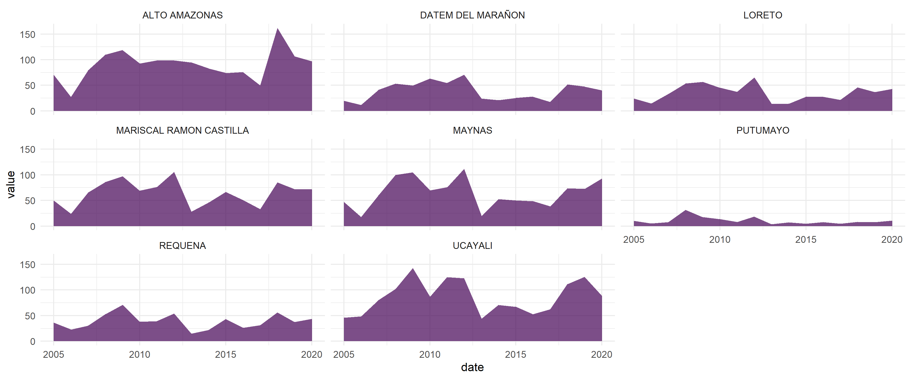

<!-- README.md is generated from README.Rmd. Please edit that file -->

# land4health: Remote Sensing Metrics for Spatial Health Analysis 

<!-- badges: start -->

[](https://lifecycle.r-lib.org/articles/stages.html#experimental)
[](https://github.com/harmonize-tools/land4health/actions/workflows/R-CMD-check.yaml)
[](./LICENSE)
<!-- badges: end -->

Calculate and extract remote sensing metrics for spatial health analysis
🛰️. This package offers R users a quick and easy way to obtain areal or
zonal statistics of key indicators and covariates, ideal for modeling
infectious diseases 🦠 within the framework of spatial epidemiology 🏥.

## Installation

You can install the development version of land4health from
[GitHub](https://github.com/harmonize-tools/land4health) with:

``` r
# install.packages("pak")
pak::pak("harmonize-tools/land4health")
```

``` r
library(land4health)
ee_Initialize(quiet = TRUE)
```

``` r
── Welcome to land4health ──────────────────────────────────────────────────────────────────
A tool of Harmonize Project to calculate and extract Remote Sensing Metrics for Spatial
Health Analysis.
Currently,`land4health` supports metrics related to the following categories:
• Enviroment
• Human intervention
• and more!
For more information about metrics, please use the `get_metrics_metadata()` function.

── Attaching core land4health packages ─────────────────────────────────────────────────────
→ rgee v1.1.7
→ sf v1.0.20
```

## Example: Calculate Forest Loss in a Custom Region

This example demonstrates how to calculate forest loss between 2005 and
2020 using a custom polygon and Earth Engine.

``` r
library(geoidep)
# Downloading the adminstration limits of Loreto provinces
provinces_loreto <- get_provinces(show_progress = FALSE) |> 
  subset(nombdep == "LORETO")

# Run forest loss calculation
result <- provinces_loreto |> 
  l4h_forest_loss(from = 2005, to = 2020,sf = FALSE)
head(result)
#> # A tibble: 6 × 11
#>      id objectid ccdd  ccpp  nombdep nombprov shape_length shape_area date      
#>   <int>    <dbl> <chr> <chr> <chr>   <chr>           <dbl>      <dbl> <date>    
#> 1   136      136 16    02    LORETO  ALTO AM…         9.96       1.57 2005-01-01
#> 2   136      136 16    02    LORETO  ALTO AM…         9.96       1.57 2006-01-01
#> 3   136      136 16    02    LORETO  ALTO AM…         9.96       1.57 2007-01-01
#> 4   136      136 16    02    LORETO  ALTO AM…         9.96       1.57 2008-01-01
#> 5   136      136 16    02    LORETO  ALTO AM…         9.96       1.57 2009-01-01
#> 6   136      136 16    02    LORETO  ALTO AM…         9.96       1.57 2010-01-01
#> # ℹ 2 more variables: value <dbl>, variable <chr>
```

``` r
# Visualization with ggplot2
library(ggplot2)
ggplot(data = result,aes(x = date,y = value)) +
  geom_area(fill = '#80b918',alpha = 0.5) + 
  facet_wrap(~nombprov) + 
  theme_minimal()
```


