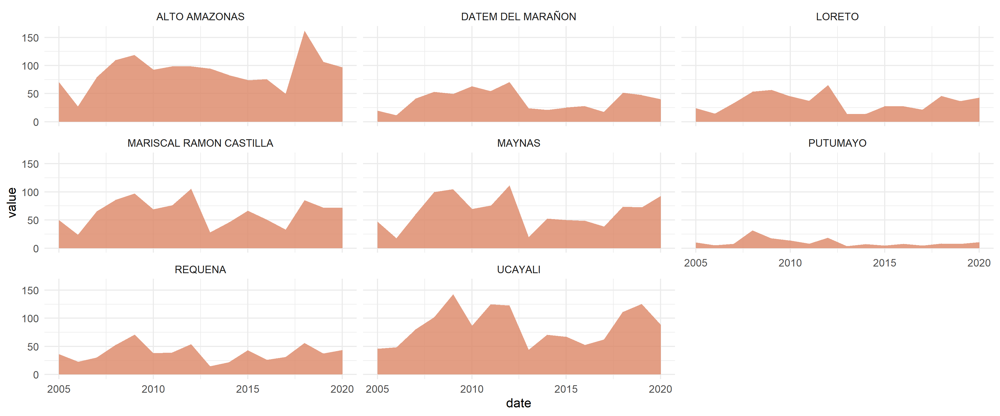
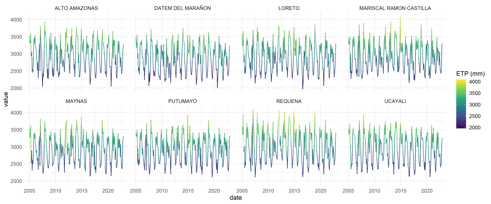

<!-- README.md is generated from README.Rmd. Please edit that file -->

# land4health: Remote Sensing Metrics for Spatial Health Analysis 

<!-- badges: start -->

[](https://lifecycle.r-lib.org/articles/stages.html#experimental)
[](https://github.com/harmonize-tools/land4health/actions/workflows/R-CMD-check.yaml)
[](./LICENSE)
<!-- badges: end -->

Calculate and extract remote sensing metrics for spatial health analysis
🛰️. This package offers R users a quick and easy way to obtain areal or
zonal statistics of key indicators and covariates, ideal for modeling
infectious diseases 🦠 within the framework of spatial epidemiology 🏥.

## 1. Installation

You can install the development version of land4health from
[GitHub](https://github.com/) with:

``` r
# install.packages("pak")
pak::pak("harmonize-tools/land4health")
```

``` r
library(land4health)
ee_Initialize(quiet = TRUE)
```

``` r
── Welcome to land4health ─────────────────────────────────────────────────────────────────────
A tool of Harmonize Project to calculate and extract Remote Sensing Metrics for Spatial Health
Analysis.
Currently,`land4health` supports metrics related to the following categories:
• Enviroment
• Human intervention
• and more!
For more information about metrics, please use the `l4h_list_metrics()` function.
Attaching core land4health packages:
→ rgee v1.1.7
→ sf v1.0.20
Avisos:
1: package ‘rgee’ was built under R version 4.4.3 
2: package ‘sf’ was built under R version 4.4.3 
```

## 2. List of available metrics

``` r
l4h_list_metrics()
#> # A tibble: 7 × 11
#>   category           metric   pixel_resolution_met…¹ dataset start_year end_year
#>   <chr>              <chr>                     <int> <chr>        <int>    <int>
#> 1 Human intervention Defores…                     30 Hansen…       2000     2023
#> 2 Human intervention Human M…                    300 Global…       1990     2017
#> 3 Human intervention Populat…                    100 WorldP…       2000     2021
#> 4 Human intervention Urban a…                    500 MODIS …       2001     2022
#> 5 Human intervention Night t…                    500 VIIRS …       1992     2023
#> 6 Human intervention Human S…                     30 Global…       1975     2030
#> 7 Enviroment         Urban H…                   1000 Urban …       2003     2020
#> # ℹ abbreviated name: ¹​pixel_resolution_meters
#> # ℹ 5 more variables: resolution_temporal <chr>, layer_can_be_actived <lgl>,
#> #   tags <chr>, lifecycle <chr>, url <chr>
```

## 3. Example: Calculate Forest Loss in a Custom Region

This example demonstrates how to calculate forest loss between 2005 and
2020 using a custom polygon and Earth Engine.

``` r
library(geoidep)
# Downloading the adminstration limits of Loreto provinces
provinces_loreto <- get_provinces(show_progress = FALSE) |>
  subset(nombdep == "LORETO")

# Run forest loss calculation
result <- provinces_loreto |>
  l4h_forest_loss(from = 2005, to = 2020, sf = TRUE)
head(result)
#> Simple feature collection with 6 features and 11 fields
#> Geometry type: MULTIPOLYGON
#> Dimension:     XY
#> Bounding box:  xmin: -76.89454 ymin: -6.14773 xmax: -75.38564 ymax: -3.681529
#> Geodetic CRS:  WGS 84
#> # A tibble: 6 × 12
#>      id objectid ccdd  ccpp  nombdep nombprov shape_length shape_area date      
#>   <int>    <dbl> <chr> <chr> <chr>   <chr>           <dbl>      <dbl> <date>    
#> 1   136      136 16    02    LORETO  ALTO AM…         9.96       1.57 2005-01-01
#> 2   136      136 16    02    LORETO  ALTO AM…         9.96       1.57 2006-01-01
#> 3   136      136 16    02    LORETO  ALTO AM…         9.96       1.57 2007-01-01
#> 4   136      136 16    02    LORETO  ALTO AM…         9.96       1.57 2008-01-01
#> 5   136      136 16    02    LORETO  ALTO AM…         9.96       1.57 2009-01-01
#> 6   136      136 16    02    LORETO  ALTO AM…         9.96       1.57 2010-01-01
#> # ℹ 3 more variables: variable <chr>, value <dbl>, geometry <MULTIPOLYGON [°]>
```

``` r
# Visualization with ggplot2
library(ggplot2)
#> Warning: package 'ggplot2' was built under R version 4.4.3
ggplot(data = st_drop_geometry(result), aes(x = date, y = value)) +
  geom_area(fill = "#DC8665", alpha = 0.8) +
  facet_wrap(~nombprov) +
  theme_minimal()
```



``` r
# Spatial visualization
ggplot(data = result) +
  geom_sf(aes(fill = value), color = NA) +
  scale_fill_gradientn(name = "Forest loss mean \n(km²)",colours = c("#DC8665","#138086","#534666","#CD7672","#eeb462")) +
  theme_minimal(base_size = 15) +
  facet_wrap(date ~ .)
```


## 4. Example: Extract time series of climate variables

``` r
etp_ts <- provinces_loreto |>
  l4h_sebal_modis(
    from = "2005-01-01",
    to = "2022-12-31",
    by = "month"
  )
```

``` r
etp_ts |>
  st_drop_geometry() |>
  ggplot(aes(x = date, y = value, col = value)) +
  geom_line() +
  scale_color_viridis_c("ETP (mm)",option = "mako") +
  theme_minimal() +
  facet_wrap(~nombprov, ncol = 4)
```


