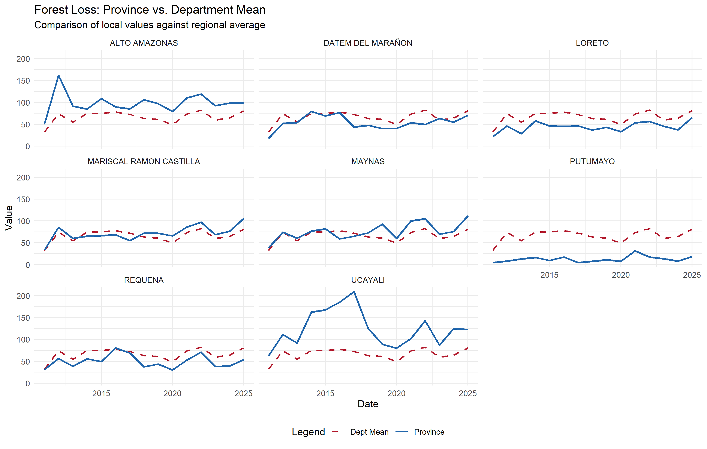
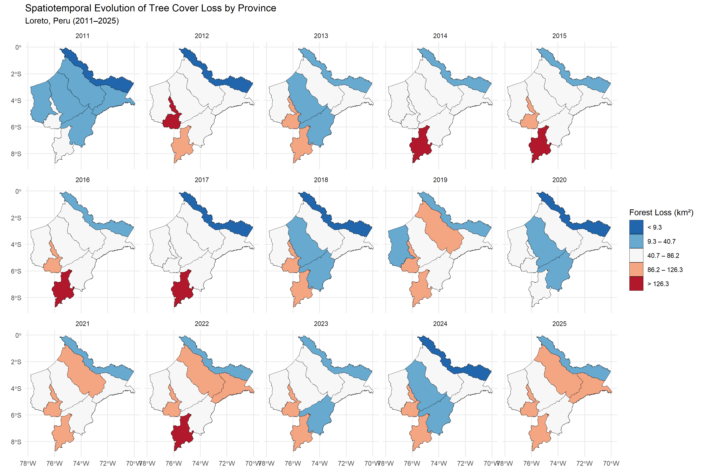
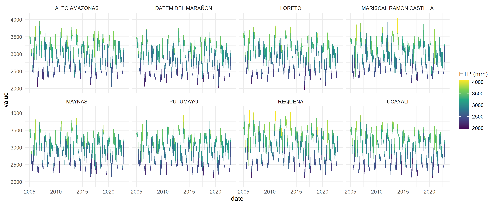

<!-- README.md is generated from README.Rmd. Please edit that file -->

# land4health: Remote Sensing Metrics for Spatial Health Analysis 

<!-- badges: start -->

[](https://lifecycle.r-lib.org/articles/stages.html#experimental)
[](https://github.com/harmonize-tools/land4health/actions/workflows/R-CMD-check.yaml)
[](https://harmonize-tools.github.io/land4health/)
[](./LICENSE)
[](https://github.com/harmonize-tools/land4health/actions/workflows/test-coverage.yaml)
[](https://app.codecov.io/gh/harmonize-tools/land4health)
<!-- badges: end -->

Calculate and extract remote sensing metrics for spatial health analysis
🛰️. This package offers R users a quick and easy way to obtain areal or
zonal statistics of key indicators and covariates, ideal for modeling
infectious diseases 🦠 within the framework of spatial epidemiology 🏥.

## 1. Installation

You can install the development version with:

``` r
# install.packages("pak")
pak::pak("harmonize-tools/land4health")
```

``` r
library(land4health)
# l4h_install()
```

    #> ── rgee 1.1.8 ──────────────────────────────────────── earthengine-api 1.7.38 ── 
    #>  ✔ user: antony.barja8@gmail.com 
    #>  ✔ Initializing Google Earth Engine: ✔ Initializing Google Earth Engine:  DONE!
    #>  ✔ Earth Engine account: projects/1009866941441/assets/BM_Castropampa 
    #>  ✔ Python Path: C:/Python314/python.exe 
    #> ────────────────────────────────────────────────────────────────────────────────

## 2. List of available metrics

``` r
l4h_list_metrics()
#> # A tibble: 10 × 11
#>    category           metric  pixel_resolution_met…¹ dataset start_year end_year
#>    <chr>              <chr>   <chr>                  <chr>        <int>    <int>
#>  1 Human intervention Defore… 30                     Hansen…       2000     2023
#>  2 Human intervention Human … 300                    Global…       1990     2017
#>  3 Human intervention Popula… 100                    WorldP…       2000     2021
#>  4 Human intervention Urban … 500                    MODIS …       2001     2022
#>  5 Human intervention Night … 500                    VIIRS …       1992     2023
#>  6 Human intervention Human … 30                     Global…       1975     2030
#>  7 Environment        Water … 30                     MapBio…       1985     2022
#>  8 Environment        Urban … 1000                   Urban …       2003     2020
#>  9 Accessibility      Travel… 927.67                 Malari…       2019     2020
#> 10 Accessibility      Rural … 100                    Rural …       2024     2024
#> # ℹ abbreviated name: ¹​pixel_resolution_meters
#> # ℹ 5 more variables: resolution_temporal <chr>, layer_can_be_actived <lgl>,
#> #   tags <chr>, lifecycle <chr>, url <chr>
#> ... (1 more)
```

## 3. Example: Calculate Forest Loss in a Custom Region

This example demonstrates how to calculate forest loss between 2005 and
2020 using a custom polygon and Earth Engine.

``` r
library(geoidep)

# Downloading the adminstration limits of Loreto provinces
provinces_loreto <- get_provinces(show_progress = FALSE) |>
  subset(nombdep == "LORETO")

# Run forest loss calculation
result <- provinces_loreto |>
  l4h_forest_loss(from = '2005-01-01', to = '2020-01-01', sf = TRUE)
head(result)
#> Simple feature collection with 6 features and 8 fields
#> Geometry type: MULTIPOLYGON
#> Dimension:     XY
#> Bounding box:  xmin: -75.78115 ymin: -4.709709 xmax: -72.11719 ymax: -0.63937
#> Geodetic CRS:  WGS 84
#> # A tibble: 6 × 9
#>   ccdd  ccpp  fuente                  nombdep nombprov date       variable value
#>   <chr> <chr> <chr>                   <chr>   <chr>    <date>     <chr>    <dbl>
#> 1 16    01    V Censo Nacional Econo… LORETO  MAYNAS   2005-01-01 forest_…  47.0
#> 2 16    01    V Censo Nacional Econo… LORETO  MAYNAS   2006-01-01 forest_…  17.7
#> 3 16    01    V Censo Nacional Econo… LORETO  MAYNAS   2007-01-01 forest_…  59.7
#> 4 16    01    V Censo Nacional Econo… LORETO  MAYNAS   2008-01-01 forest_…  99.8
#> 5 16    01    V Censo Nacional Econo… LORETO  MAYNAS   2009-01-01 forest_… 105. 
#> 6 16    01    V Censo Nacional Econo… LORETO  MAYNAS   2010-01-01 forest_…  69.5
#> # ℹ 1 more variable: geometry <MULTIPOLYGON [°]>
```

``` r
# Visualization with ggplot2
library(ggplot2)
#> Warning: package 'ggplot2' was built under R version 4.5.3
ggplot(data = st_drop_geometry(result), aes(x = date, y = value)) +
  geom_area(fill = "#FDE725FF", alpha = 0.8) +
  facet_wrap(~nombprov) +
  theme_minimal()
```



``` r
# Spatial visualization
ggplot(data = result) +
  geom_sf(aes(fill = value), color = NA) +
  scale_fill_viridis_c(name = "Forest loss mean \n(km²)") +
  theme_minimal(base_size = 15) +
  facet_wrap(date ~ .)
```



## 4. Example: Extract time series of climate variables

``` r
etp_ts <- provinces_loreto |>
  l4h_sebal_modis(
    from = "2005-01-01",
    to = "2022-12-31",
    by = "month"
  )
```

``` r
etp_ts |>
  st_drop_geometry() |>
  ggplot(aes(x = date, y = value, col = value)) +
  geom_line() +
  scale_color_viridis_c("ETP (mm)",option = "viridis") +
  theme_minimal() +
  facet_wrap(~nombprov, ncol = 4)
```


