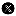

# Compute Rural Access Index (RAI)

Calculates the Rural Access Index (RAI) for a given region using
datasets from the GEE Community Catalog. The RAI represents the
proportion of the rural population living within 2 km of an all-season
road, aligning with SDG indicator 9.1.1.

**\[stable\]**

## Usage

``` r
l4h_rural_access_index(
  region,
  weighted = FALSE,
  fun = NULL,
  sf = FALSE,
  quiet = FALSE,
  force = FALSE,
  ...
)
```

## Arguments

- region:

  A spatial object defining the region of interest. Can be an `sf`,
  `sfc` object, or a `SpatVector` (from the terra package).

- weighted:

  Logical. If `TRUE`, computes a population-weighted RAI (i.e., rural
  population with access divided by total rural population). If `FALSE`,
  computes an area-based RAI (i.e., total pixel area with access divided
  by total rural area). Default is `FALSE`.

- fun:

  Character. Summary function to apply to the population raster when
  `weighted = TRUE`. Common values include `"mean"`, `"sum"`, etc.
  Ignored when `weighted = FALSE`. Default is `"mean"`.

- sf:

  Logical. If `TRUE`, returns the result as an `sf` object. If `FALSE`,
  returns an Earth Engine object. Default is `FALSE`.

- quiet:

  Logical. If TRUE, suppress the progress bar (default FALSE).

- force:

  Logical. If `TRUE`, skips the representativity check and forces the
  extraction. Default is `FALSE`.

- ...:

  arguments of `ee_extract` of `rgee` packages.

## Value

A spatial object containing the computed RAI value for the region in an
`sf` or `tibble` object.

## Details

This function uses the following datasets from the GEE Community
Catalog:

- `projects/sat-io/open-datasets/RAI/ruralpopaccess/` – raster of rural
  population with access to all-season roads

- `projects/sat-io/open-datasets/RAI/inaccessibilityindex/` – binary
  raster indicating access areas (1 = access, 0 = no access)

When `weighted = TRUE`, the RAI is calculated as the sum (or chosen
summary via `fun`) of the accessible rural population divided by the
total rural population within the specified region.

When `weighted = FALSE`, the RAI is calculated as the ratio of pixel
areas: the total area (in in km^2) with access divided by the total
rural area.

The `fun` parameter only applies when `weighted = TRUE`. It will be
ignored otherwise.

## Credits

[](https://www.innovalab.info/)

Pioneering geospatial health analytics and open‐science tools. Developed
by the Innovalab Team, for more information send a email to
<imt.innovlab@oficinas-upch.pe>

Follow us on :

- [Innovalab
  Linkedin](https://www.linkedin.com/company/innovalab-imt),
  [Innovalab
  X](https://x.com/innovalab_imt)

- [Innovalab
  facebook](https://www.facebook.com/imt.innovalab),
  [Innovalab
  instagram](https://www.instagram.com/innovalab_imt/)

- [Innovalab
  tiktok](https://www.tiktok.com/@innovalab_imt),
  [Innovalab
  Podcast](https://www.innovalab.info/podcast)

## References

GEE Community Catalog: <https://gee-community-catalog.org/projects/rai/>

Frontiers in Remote Sensing (2024):
[doi:10.3389/frsen.2024.1375476](https://doi.org/10.3389/frsen.2024.1375476)

## Examples
