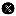
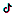

# Extract vegetation indices from MODIS MOD13A1

Computes monthly or annual areal statistics of vegetation indices (NDVI,
EVI, or SAVI) from MODIS MOD13A1 (500 m, 16-day composite) for a given
spatial region, applying quality filtering via the `DetailedQA` bitmask.

**\[stable\]**

## Usage

``` r
l4h_vegetation(
  region,
  from,
  to,
  band = c("NDVI", "EVI", "SAVI"),
  by = c("month", "year"),
  fun = c("mean", "max", "min", "median", "sum", "sd", "first"),
  scale = 500,
  sf = FALSE,
  quiet = FALSE
)
```

## Arguments

- region:

  An `sf` object (polygon or multipolygon). Must be in a geographic CRS
  (or will be reprojected to WGS84 internally).

- from:

  Character. Start date in `"YYYY-MM-DD"` format. Valid range:
  `"2000-02-18"` onwards.

- to:

  Character. End date in `"YYYY-MM-DD"` format.

- band:

  Character. Vegetation index to extract. One of `"NDVI"`, `"EVI"`, or
  `"SAVI"`. Default: `"NDVI"`.

- by:

  Character. Temporal aggregation unit. One of `"month"` (default) or
  `"year"`.

- fun:

  Character. Zonal statistic to compute over the region. One of
  `"mean"`, `"max"`, `"min"`, `"median"`, `"sum"`, `"sd"`, `"first"`.
  Default: `"mean"`.

- scale:

  Numeric. Nominal scale in metres for the GEE projection. Default:
  `500` (native MOD13A1 resolution).

- sf:

  Logical. If `TRUE`, returns an `sf` object with geometries attached.
  Default: `FALSE`.

- quiet:

  Logical. If `TRUE`, suppresses the progress bar. Default: `FALSE`.

## Value

A tibble (or `sf` tibble if `sf = TRUE`) in long format:

- `<id_cols>`:

  Original attribute columns from `region`.

- `date`:

  `Date` object. First day of each month (`by = "month"`) or first day
  of each year (`by = "year"`).

- `variable`:

  Name of the vegetation index (e.g. `"NDVI"`).

- `value`:

  Computed zonal statistic for that region and period.

## Details

### Temporal aggregation

MODIS MOD13A1 produces one composite every **16 days**. This function
aggregates those composites into a coarser temporal unit:

- `by = "month"`: All 16-day images within each calendar month are
  reduced to a single image using
  [`max()`](https://rdrr.io/r/base/Extremes.html) (maximum value
  composite), yielding one value per region per month.

- `by = "year"`: All 16-day images within each calendar year are reduced
  to a single image using
  [`max()`](https://rdrr.io/r/base/Extremes.html), yielding one value
  per region per year.

The `fun` argument controls the **spatial** (zonal) statistic applied
over each region polygon, and is independent of the temporal
aggregation.

### Quality filtering

Applied through the `DetailedQA` bitmask of `MODIS/061/MOD13A1`:

- Bits 0-1: VI quality (value `2` = not produced/cloudy, excluded).

- Bit 14: Adjacent cloud detected (excluded).

- Bit 15: Possible shadow (excluded).

### Scale factors

- `NDVI` and `EVI`: multiplied by `0.0001`.

- `SAVI`: computed on-the-fly from surface reflectance bands
  `sur_refl_b01` (red) and `sur_refl_b02` (NIR), L = 0.5.

## Credits

[](https://www.innovalab.info/)

Pioneering geospatial health analytics and open‐science tools. Developed
by the Innovalab Team, for more information send a email to
<imt.innovlab@oficinas-upch.pe>

Follow us on :

- [Innovalab
  Linkedin](https://www.linkedin.com/company/innovalab-imt),
  [Innovalab
  X](https://x.com/innovalab_imt)

- [Innovalab
  facebook](https://www.facebook.com/imt.innovalab),
  [Innovalab
  instagram](https://www.instagram.com/innovalab_imt/)

- [Innovalab
  tiktok](https://www.tiktok.com/@innovalab_imt),
  [Innovalab
  Podcast](https://www.innovalab.info/podcast)

## Examples

``` r
if (FALSE) { # \dontrun{
library(land4health)
library(geoidep)

rgee::ee_Initialize(quiet = TRUE)

provinces <- get_provinces(show_progress = FALSE) |>
  subset(nombdep == "LORETO")

# Monthly mean NDVI
result_monthly <- provinces |>
  l4h_vegetation(
    from = "2010-01-01",
    to   = "2012-12-31",
    band = "NDVI",
    by   = "month",
    fun  = "mean",
    sf   = TRUE
  )

# Annual mean NDVI
result_annual <- provinces |>
  l4h_vegetation(
    from = "2010-01-01",
    to   = "2020-12-31",
    band = "NDVI",
    by   = "year",
    fun  = "mean",
    sf   = TRUE
  )
} # }
```
